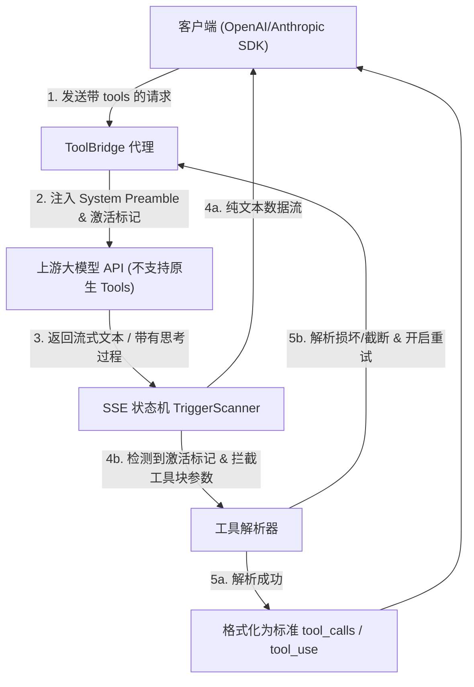

# ToolBridge 🛠️

**ToolBridge** 是一个轻量级、零依赖的 OpenAI / Anthropic 兼容的 **Tool-calling (工具调用) 桥接代理服务器**。

它可以将**不支持原生工具调用**的上游大模型 API（例如 DeepSeek、开源本地大模型等）包装为支持标准 `tools`、`tool_choice` 和 `parallel_tool_calls` 的 OpenAI 兼容接口，并且支持完整的 Anthropic Messages API (`/v1/messages`) 协议及流式 (SSE) 转换。

---

## 🌟 核心特性

- **🧩 虚拟工具调用 (Virtual Tool Calling)**
  - 自动向模型注入精巧设计的 System Prompt 模板，动态生成单次请求唯一的激活标记（如 `[[CALL-xxxxxx]]`）。
  - **强大的多级解析器**：首选标准 JSON 解析；若模型输出轻微损毁（如缺失括号），自动降级为正则提取，大幅提升低参数量模型的工具调用成功率。
  - **自动纠错与重试循环**：检测到模型输出截断或 JSON 语法损坏时，可自动携带诊断信息向模型发起多轮继续生成/纠错请求。
- **⚡ 实时流式扫描状态机 (TriggerScanner)**
  - 支持在 SSE 流式文本输出时，实时扫描并屏蔽 `<thinking>...</thinking>` 深度思考块。
  - 在流式输出文本中实时匹配工具调用激活标记，发现后**瞬间掐断向客户端的文本发送**，将后续参数流静默缓存入内存，等流式结束后自动转换为标准的结构化工具调用事件。
- **🔄 协议双向互转 (OpenAI ↔ Anthropic)**
  - 完整适配 Anthropic Messages 协议，支持多模块消息（如图片、多工具输入）扁平化为 OpenAI Role/Content。
  - 支持将 OpenAI 的流式 SSE Chunk 实时映射为标准的 Anthropic 消息流事件。
- **🖥️ 现代桌面托盘客户端 (CustomTkinter + PyStray)**
  - 提供美观的桌面设置面板，支持在系统托盘管理服务的启动、关闭和配置参数的热重启。
  - **跨平台开机自启**：支持 Windows (注册表 `pythonw` 无黑窗口启动)、macOS (LaunchAgent Plist) 及 Linux (XDG Autostart)。
- **🛡️ 纯标准库实现 (核心 CLI 模式)**
  - CLI 模式下 **零第三方依赖**，纯 Python 标准库 (`http.server` + `urllib`) 驱动，极其轻量，容器化部署体积小。

---

## 📐 架构设计

以下是 ToolBridge 拦截并处理工具调用请求的数据流图：



---

## 🚀 快速开始

### 方式一：直接运行 (CLI 模式 - 零依赖)

您只需 Python 3.8+ 环境，无需安装任何包：

```bash
# 配置环境变量
export UPSTREAM_BASE_URL="http://your-upstream:3000"
export UPSTREAM_AUTH_HEADER="Bearer sk-your-key"
export MODEL_MAP_JSON='{"my-model": "upstream-model-v1"}'

# 运行服务
python -m toolbridge
```

### 方式二：Docker 部署

可以使用 Docker 一键构建和运行：

```bash
docker build -t toolbridge .
docker run -d \
  -e UPSTREAM_BASE_URL="https://api.deepseek.com" \
  -e UPSTREAM_AUTH_HEADER="Bearer sk-..." \
  -p 8080:8080 \
  toolbridge
```

### 方式三：桌面托盘模式 (GUI 模式)

桌面 GUI 模式需要安装额外的桌面组件包（如 `customtkinter`、`pystray`、`Pillow`）：

```bash
pip install -r requirements-desktop.txt
python -m toolbridge --desktop
```
运行后，程序将常驻在系统托盘，您可以右键点击选择 **设置...** 轻松配置上游地址、映射规则、开机自启等参数。

---

## ⚙️ 环境变量与配置选项

在 CLI 或 Docker 部署时，您可以通过以下环境变量配置服务：

| 环境变量 | 默认值 | 说明 |
| :--- | :--- | :--- |
| `HOST` | `0.0.0.0` | 服务的监听主机地址 |
| `PORT` | `8080` | 服务的监听端口 |
| `UPSTREAM_BASE_URL` | `http://127.0.0.1:3000` | 上游模型的 API 基础地址 |
| `UPSTREAM_AUTH_HEADER` | (空) | 转发给上游的 `Authorization` 请求头 |
| `UPSTREAM_TIMEOUT_SECONDS` | `240` | 请求上游的超时时间（秒） |
| `MODEL_MAP_JSON` | `{}` | 模型名称映射关系 JSON，如 `{"gpt-4": "deepseek-chat"}` |
| `ALLOW_UNMAPPED_MODEL_PASSTHROUGH` | `true` | 是否允许未配置映射的模型直接直通转发 |
| `NATIVE_TOOL_MODELS_JSON` | `[]` | 声明哪些上游模型自带原生工具调用能力（直接透传） |
| `FC_ERROR_RETRY` | `true` | 工具调用解析失败或截断时是否发起自动纠错重试 |
| `FC_ERROR_RETRY_MAX_ATTEMPTS` | `3` | 自动纠错的最大重试次数 |
| `TOOL_PROMPT_PREAMBLE` | (内置) | 虚拟工具指令的 Prompt 前导词 |

---

## 🛣️ 接口端点

- `GET /health`：健康检查接口。
- `GET /v1/models`：获取可用模型列表（包含配置的映射名称）。
- `POST /v1/chat/completions`：OpenAI 兼容聊天接口。
- `POST /v1/messages`：Anthropic 兼容聊天接口。
- `其他端点`：原样转发至上游 API，保持通配兼容性。

---

## ⚖️ 开源许可证

本项目基于 [MIT 许可证](LICENSE) 开源。
